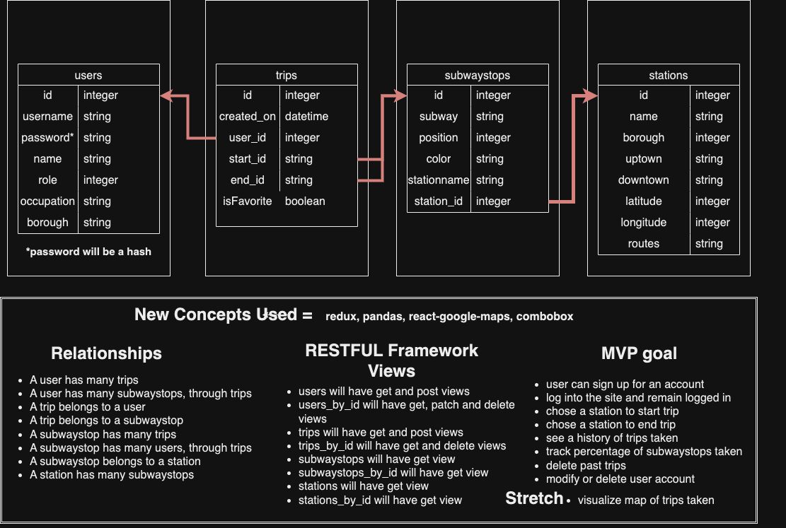

#  I :heart: MTA
*I :heart: MTA APP is a full-stack application* 
*React-Redux frontend*
*FLask-SQLAlchemy backend*

## draw.io

### External API's and other data used
For this project, I used Google Maps API key as well as MTA's API key. Google maps provided the map which acts as a canvas for the subway trip drawings. As well, Google provided the necessary direction rendering for the subway trip. This direction rendering  provided a list of latitude/longitude direction coordinates that was used to draw polylines with colors cooresponding to the train color. The MTA provided necessary subwaystop information, including information on over 700 subwaystops (names, lat/lng directions, descriptions, transfer routes). Unfortunately, the MTA did not provide a ordered list of subway stops for each subway route. To get this last piece of information, I had to scrape the MTA's website and use beautiful soup to compile a ordered list from uptown to downtown of every subwaystop station.

### User Experience

    -SignIn and SignUp-

Users will be able to sign up for a profile by creating a few credentials, such as a username and a password, while also entering some basic personal information, such as name and borough of residency. Users will then be able to sign in and access all of the application features. User's sign in information will be stored and remembered for future sign ins.

    -Profile (Home Page)-

Upon entering the application, the User will see their profile information. The User can edit certain personal information such as name or occupation once they reenter their password. User can press "Show pass trips" to watch the map populate polylines of subway trips taken (corresponding train colors provided).

    -Add a trip-

In the "add a trip" section, a user will be able to add a subway trip experience to their profile. User will first have their map display the borough of their residency. They will be asked which borough this trips starts in. Then they will be asked which station they are beginning their trip at. Upon selection, the map will rereference itself to the location of the station. The user will then be asked which train they intend to take and which direction they are heading toward. Lastly, the user will be given a list of end station options. Upon picking an end station, the map will rereference itself to display the end station. Lastly, the user will select to add the trip to their profile. A polyline will populate displaying the subway path and the trip will be added to the user's profile.

    -Dashboard/All Trips and Favorites-

In the all trips section of the user's dashboard, a user can see all of their past trips in more detail (how many stops traveled, train route taken, etc.). Here, a user can opt to add a trip to their favorites section. The favorites section allows a user to see chosen favorite trips.

    -Dashboard/Statistics-

In the statistics section of the user's dashboard, a user can see provided statistics of their trips. For example, a user is able to see what percentage of a subway train's route that user has riden through.

    -Dashboard/All Subway Stops-

In this section, a user can see all the subway routes and all of their station stops in order. This section is similar to the one on the sign in page and can be used as a reference guide for users.